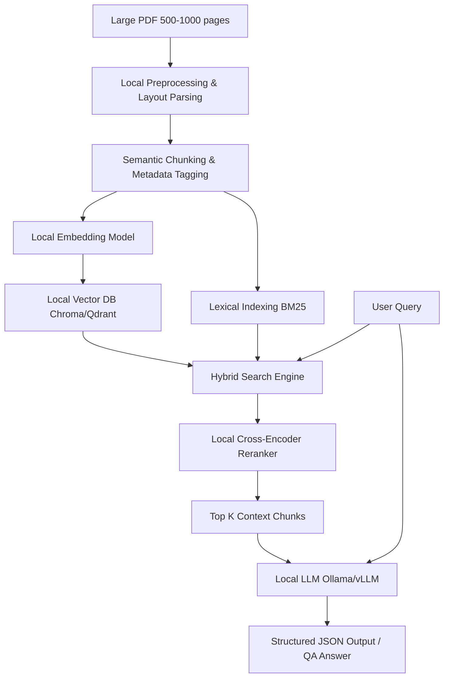

# Local AI Architecture for Processing & Querying Large PDFs (500–1000 Pages)

This document outlines the architecture and implementation plan for building a highly robust, secure, and fully local AI system capable of extracting structured data and answering complex queries from massive PDFs.

---

## 1. Document Ingestion & Extraction Pipeline

Processing 500–1000 page PDFs requires special attention to memory management, structural integrity (tables/figures), and parsing speed.

### A. Document Parsing
Standard flat text extractors (like `PyPDF`) lose table structures and document hierarchy. We recommend layout-aware parsing:
*   **Engine Option 1 (Advanced/Structural)**: **Docling** (by IBM) or **Marker**. These tools convert PDFs to structured Markdown, preserving tables, headers, and reading order using layout models.
*   **Engine Option 2 (Python Native)**: **pdfplumber** combined with OCR (like **Tesseract** or local **EasyOCR**) for scanned documents.
*   **Process**: Stream pages to avoid memory exhaustion (never load the entire 1000-page PDF string into RAM at once).

### B. Hierarchical & Layout-Aware Chunking
Flat chunking (e.g., fixed 500 characters) breaks tables, lists, and sentences.
*   **Chunk Strategy**: Split by Markdown headers (`#`, `##`, `###`) generated by the parser. Keep sections intact.
*   **Target Size**: $500$ to $1000$ tokens per chunk, with a $10-15\%$ overlap.
*   **Metadata Injection**: Enrich each chunk with:
    *   `page_number`: Crucial for source citation.
    *   `section_title`: Retains document structure context.
    *   `document_id` & `document_name`.

---

## 2. Embedding & Local Vector Storage

To achieve semantic search over millions of chunks across multiple large documents, we need local embedding generation and storage.

### A. Local Embedding Model
*   **Recommendation**: **`nomic-embed-text-v1.5`** or **`BAAI/bge-large-en-v1.5`** running locally via Ollama or Hugging Face.
*   **Why**: High retrieval accuracy, small footprint, and support for up to 8192 context length (Nomic).

### B. Local Vector Database
*   **Recommendation**: **Qdrant** (running via a local Docker container) or **LanceDB** (embedded file-based database, ideal for simple setups).
*   **Why**: Qdrant is lightweight, has exceptional speed, and supports hybrid filtering (combining payload metadata matching with vector similarity).

---

## 3. Hybrid Search & Reranking (Local Retrieval)

To ensure queries for exact terms (e.g., serial numbers, specific terms) and semantic concepts are both resolved correctly:

### A. Dense + Sparse Retrieval (Hybrid)
*   **Dense Search**: Vector similarity (Cosine/Dot Product) on embedding indices.
*   **Sparse Search**: Lexical BM25 search (e.g., using `Rank-BM25` or built-in Qdrant sparse vectors) for exact term matching.
*   **Reciprocal Rank Fusion (RRF)**: Combine the rankings of dense and sparse searches mathematically.

### B. Local Cross-Encoder Reranker
*   **Recommendation**: **`BAAI/bge-reranker-base`** (run locally via Hugging Face/Transformers).
*   **Why**: Standard vector databases retrieve chunks based on general similarity. A reranker computes a joint relevance score between the query and each chunk, dramatically filtering out noise.
*   **Flow**: Retrieve Top 50 chunks via Hybrid Search $\rightarrow$ Rerank with Cross-Encoder $\rightarrow$ Keep Top 5–10 chunks for the LLM.

---

## 4. Local LLM & Context Management

### A. Local Inference Engines
To serve LLMs locally with high throughput:
*   **Ollama**: Easiest setup, handles CPU/GPU offloading automatically.
*   **llama.cpp**: Minimal footprint, highly optimized for CPU/Apple Silicon.
*   **vLLM**: Highly recommended if you have a dedicated NVIDIA GPU with $\ge 16\text{ GB}$ VRAM (supports PagedAttention).

### B. LLM Selection (Local-focused)
*   **`Qwen2.5-7B-Instruct` / `Qwen2.5-14B-Instruct`**: Outstanding performance at structured data extraction, supports 128k context window.
*   **`Llama-3.1-8B-Instruct`**: Highly robust general-purpose instruct model, supports 128k context window.
*   **`Mistral-7B-Instruct-v0.3`**: Reliable, highly responsive, supports 32k context.

### C. Structured Data Extraction
If the goal is to extract schema-specific data (e.g., tables, key-value pairs) rather than just chat:
*   Use **Instructor** (Python library) with local LLMs, or **Outlines** / **Guidance**.
*   These tools enforce **JSON Schema** validation at the token generation level (CFG grammar constraints), ensuring the LLM *always* outputs valid JSON matching your schema.

---

## 5. Deployment & Hardware Recommendations

### Recommended Hardware Spec
*   **CPU-Only (Slow but functional)**: $\ge 32\text{ GB}$ RAM, fast NVMe SSD. Use GGML/GGUF 4-bit quantized models.
*   **Consumer GPU / Apple Silicon (Fast/Recommended)**:
    *   **Mac**: Apple Mac Studio or MacBook Pro M-series with $\ge 36\text{ GB}$ Unified Memory.
    *   **PC/Linux**: NVIDIA RTX 3090 / 4090 ($24\text{ GB}$ VRAM) or RTX 4080 ($16\text{ GB}$ VRAM). Fits quantized 8B-14B parameter models entirely in VRAM.

### Suggested Tech Stack
*   **Backend Application**: Python (FastAPI).
*   **PDF Extraction**: `docling` or `pdfplumber`.
*   **Vector DB**: `Qdrant` (Dockerized).
*   **Inference Server**: `Ollama` or `llama.cpp`.
*   **Orchestration**: `LangChain` or `LlamaIndex` (or custom lightweight Python pipeline for lower overhead).
